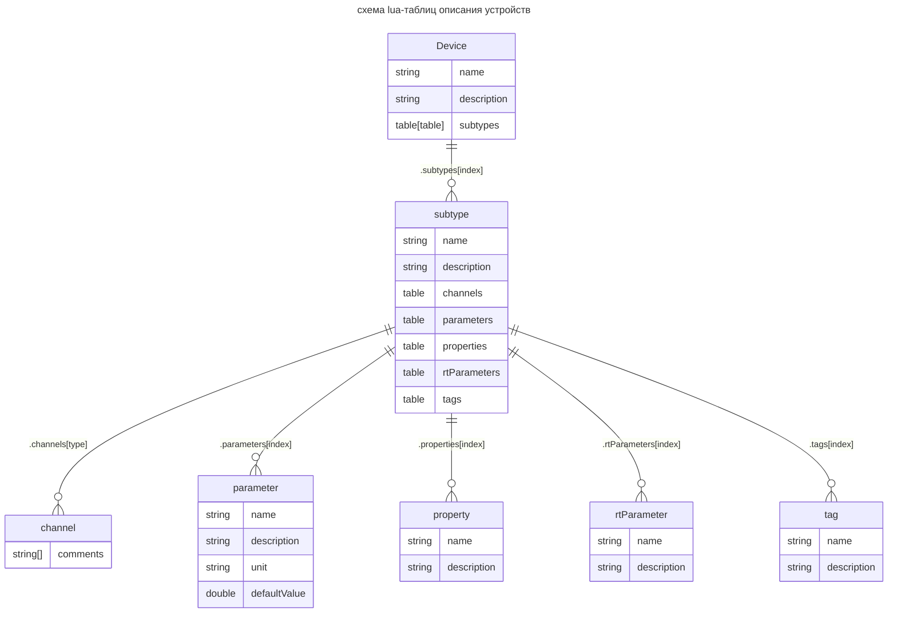

# Описание устройств





Пример название файла: **`DEV.lua`** - название совпадает с типом устройства.
Файл создается в текущем каталоге [***./dev/types/***](./)

```Lua
local DEV = {
    name = 'DEV', -- Название типа устройства
    description = 'Описание устройства',
    subtypes = {}, -- Описание подтипов
}

-- Для удобства описание подтипов выносится за таблицу устройства:

DEV.subtypes[ 1 ] = { -- [ 1 ] - номер подтипа
    name = 'DEV_ST_1', -- Название подтипа
    description = 'Описание подтипа',
    
    -- Описание каналов подтипа: AO, AI, DO, DI;
    channels = {
        AO = {}, -- Один канал
        AI = { 'Открыт', 'Закрыт' }, -- Два именованных канала
    },

    -- Описание используемых параметров:
    parameters = {
        -- Параметр:
        Parameter.P_DT,
        -- Параметр со значением по-умолчанию:
        Parameter.P_k:withDefaultValue(1),
        -- Повторяющийся параметр со значением по умолчанию { name = P_k2, defaultValue = 1.2 }:
        Parameter.P_k:number(2):withDefaultValue(1.2), 
        -- Так тоже можно: (без добавления в parameters.lua)
        {
            name = 'P_P',
            description = 'Описание',
            unit = '{0} у.е.',
            defaultValue = 1,
        },
    },
    
    -- Описание используемых параметров времени выполнения
    rt_parameters = {
        -- Параметр 1
        RtParameter = R_AS_NUMBER,
        -- Параметр 2: (без добавления в runtime_parameters.lua)
    }

    -- Описание используемых свойств:
    properties = {
        -- Свойство IP:
        Property.IP,
        -- Свойство Property: (без добавления в properties.lua)
        {
            name = 'Property',
            description = 'Описание',
        },
    },

    -- Описание тегов устройства:
    tags = {
        -- Тег с таблицы тегов:
        Tag.ST,
        -- Тег с таблицы параметров:
        Parameter.P_FB,
        -- Индексируемый тег:
        Tag.ST_CH:count(4), -- (dev.ST_CH[ 1 ], ..., dev.ST_CH[ 4 ])
    },
}

-- Второй подтип
DEV.subtypes[ 2 ] = {
    ...
}

return DEV
```

Использование модуля `DEV.lua` в [devices.lua](../devices.lua)
```diff
local devices = {
    ...
    [ 4 ] = require '...',
+   [ 5 ] = require 'DEV',
}

return devices
```